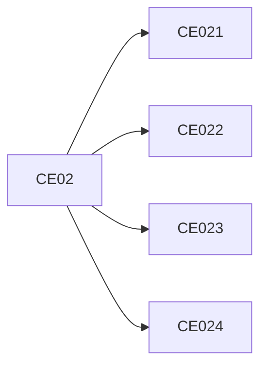

# 1. Competencias del Programa

## Ingeniería de Software

> **CE02 — Gestiona y desarrolla software de manera eficiente y efectiva, basándose en estándares internacionales de calidad a fin de lograr el control y aseguramiento de la calidad según el contexto de la organización.**
 Rol: Software Engineer 

## Tabla SW1. Competencias específicas

| Competencia específica | Detalle de la competencia según CDIO / SWEBOK / ISO 12207 |
|---|---|
| **CE021 Ingeniería de Requerimientos** | Define, analiza, valida y documenta requerimientos del sistema; diseña la arquitectura y realiza el modelado funcional y estructural. *Rol: Ingeniero de Requerimientos o Analista Funcional / Arquitecto de Software* |
| **CE022 Ingeniería de la Información** | Modela, implementa, asegura y administra bases de datos para soportar los requerimientos de información del sistema. *Rol: DBA o Ingeniero de Datos orientado a bases de datos* |
| **CE023 Programación** | Construye soluciones de software mediante la implementación de componentes, servicios e interfaces funcionales integradas. *Rol: Desarrollador Móvil / Desarrollador de Software* |
| **CE024 Calidad de Software** | Evalúa la calidad del software, valida su funcionamiento, automatiza procesos de verificación y define acciones de mejora y evolución. *Rol: QA Engineer / DevOps Engineer* |

## Criterios de evaluación

### CE021 — Ingeniería de Requerimientos: Define y diseña el sistema
Define, analiza y valida requerimientos funcionales y no funcionales, y diseña la arquitectura del sistema, modelando el comportamiento desde la perspectiva del usuario y del negocio mediante representaciones estructuradas (SRS, prototipos, arquitectura y UML), asegurando trazabilidad, coherencia y alineación con el contexto organizacional y restricciones del sistema.  
**Cursos:** IR, ADS

### CE022 — Ingeniería de la Información: Gestiona los datos
Modela, diseña, implementa y administra estructuras de datos operacionales, dimensionales y datasets, garantizando integridad, consistencia, rendimiento, seguridad y disponibilidad de la información, asegurando su uso eficiente en el soporte a procesos y toma de decisiones.  
**Cursos:** BD1, BD2

### CE023 — Programación: Construye el software
Desarrolla e integra soluciones de software de escritorio, web, distribuido y móvil, implementando la estructura, componentes y comportamiento del sistema mediante modelos técnicos, aplicando principios de modularidad, desacoplamiento, patrones de diseño y buenas prácticas de desarrollo para lograr soluciones funcionales y mantenibles.  
**Cursos:** FP, POO, LP1, LP2, DIST, MOV

### CE024 — Calidad de Software: Asegura y mejora la calidad
Gestiona y asegura la calidad del producto y del proceso de desarrollo de software, mediante la aplicación de pruebas automatizadas, integración y entrega continua (CI/CD), métricas, revisión técnica, gestión de deuda técnica y auditorías, promoviendo la mejora continua y la madurez del proceso.  
**Cursos:** IS1, PDS, IS2

## Vista estructural

