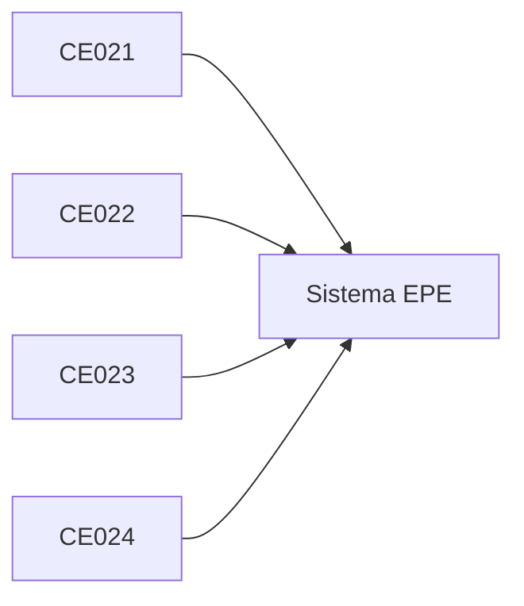

# 5. Evaluación EPE

## 5.1 Integración del perfil

## Matriz — Evaluación EPE (macro final)

| CE | Evidencia de perfil (integrada) | Entregable EPE | Rúbrica (criterios de evaluación) |
|---|---|---|---|
| **CE021** Ingeniería de Requerimientos | Requerimientos, prototipos, arquitectura y modelado del sistema coherentes, trazables y validados con stakeholders | **Documento del sistema:** - SRS completo - Prototipos navegables - Arquitectura (vistas, decisiones) - UML | - Completitud y claridad - Coherencia entre artefactos - Trazabilidad - Alineación con el problema y necesidades del negocio - Validación con stakeholders |
| **CE022** Ingeniería de la Información | Modelo de datos implementado, consistente y operando con seguridad y rendimiento, alineado a los requerimientos del sistema | **Base de datos del sistema:** - Modelo de datos - SQL funcional - Programación BD - Seguridad y administración | - Integridad de datos - Normalización y modelado - Rendimiento - Seguridad - Consistencia con requerimientos |
| **CE023** Programación | Sistema de software funcional, integrado y alineado a los requerimientos definidos, implementado mediante una arquitectura adecuada | **Sistema desarrollado:** - Implementación funcional - Integración de componentes - Arquitectura aplicada - Despliegue operativo | - Funcionalidad completa - Integración entre componentes - Calidad del código - Arquitectura implementada - Desempeño del sistema - Coherencia con los requerimientos |
| **CE024** Calidad de Software | Sistema validado, automatizado y evaluado con evidencia de calidad técnica y mejora continua | **Sistema validado y gestionado:** - Pruebas automatizadas - Pipeline CI/CD - Evidencia de calidad técnica - Auditoría + plan de evolución | - Cobertura y efectividad de pruebas - Automatización (CI/CD) - Gestión técnica del sistema - Métricas del sistema - Propuesta de mejora continua |

### Integración del perfil (gráfico)

## 5.2 Enfoque de evaluación

La Evaluación del Perfil de Egreso (EPE) se realiza sobre productos integradores del estudiante, alineados a las competencias del programa:

- CE021 Ingeniería de Requerimientos
- CE022 Ingeniería de la Información
- CE023 Programación
- CE024 Calidad de Software

Cada competencia se evalúa mediante una **rúbrica específica**, basada en evidencia observable del sistema desarrollado.

## 5.3 Escala de evaluación

| Nivel | Rango |
|---|---|
| Excelente | 18–20 |
| Bueno | 15–17 |
| Regular | 13–14 |
| Deficiente | <13 |

## 5.4 Rúbricas de evaluación por competencia (Nivel 3 – EPE)

Las siguientes rúbricas evalúan el logro de cada competencia del programa sobre productos reales del sistema desarrollado.

### 5.4.1 Rúbrica CE021 — Ingeniería de Requerimientos

**Artefacto evaluado:**  
Especificación completa del sistema (SRS + Prototipos + Arquitectura + UML)

**Principio:**  
Evalúa la correcta concepción del sistema antes de su construcción.  
No evalúa implementación ni funcionamiento del sistema.

**Criterios de evaluación:**

- Completitud y claridad de requerimientos
- Coherencia entre requerimientos, prototipos y diseño del sistema
- Definición de arquitectura del sistema
- Modelado del sistema (UML)
- Trazabilidad de requerimientos
- Validación con stakeholders

### 5.4.2 Rúbrica CE022 — Ingeniería de la Información

**Artefacto evaluado:**  
Base de datos del sistema en operación

**Principio:**  
Evalúa la calidad, consistencia, seguridad y eficiencia de los datos.

**Criterios de evaluación:**

- Modelado de datos
- Integridad y consistencia de datos
- Implementación y consultas SQL
- Programación de base de datos
- Seguridad y administración
- Rendimiento y optimización

### 5.4.3 Rúbrica CE023 — Programación

**Artefacto evaluado:**  
Sistema de software funcional completo integrado

**Principio:**  
Evalúa la construcción del sistema.  
No evalúa pruebas ni calidad (eso corresponde a CE024).

**Criterios de evaluación:**

- Arquitectura e integración del sistema
- Funcionalidad del sistema
- Integración entre capas y servicios
- Calidad del código
- Desempeño y comportamiento del sistema
- Escalabilidad y diseño técnico

### 5.4.4 Rúbrica CE024 — Calidad de Software

**Artefacto evaluado:**  
Sistema validado, automatizado, evaluado y mejorado

**Principio:**  
Evalúa la confiabilidad, control y mejora continua del sistema.  
No evalúa funcionalidad (eso corresponde a CE023).

**Criterios de evaluación:**

- Cobertura y calidad de pruebas
- Automatización (CI/CD)
- Uso de métricas y evaluación
- Gestión técnica del desarrollo
- Auditoría técnica del sistema
- Propuesta de mejora continua

### 5.4.5 Rúbrica de sustentación — CE0217

**Artefacto evaluado:**  
Defensa técnica del sistema

**Criterios de evaluación:**

- Dominio técnico del sistema
- Claridad y estructura de la presentación
- Sustento de decisiones técnicas
- Demostración del sistema
- Capacidad de síntesis y comunicación
- Respuesta a preguntas

## 5.5 Consideraciones finales de evaluación

- La evaluación se realiza sobre productos reales del sistema desarrollado.
- Cada competencia se evalúa de forma independiente mediante su rúbrica.
- No se evalúan fases del proyecto, sino resultados evidenciables.
- No se fuerza el uso de tecnologías específicas.
- La evaluación está alineada al perfil de egreso.

## 5.6 Declaración de coherencia

El modelo de evaluación EPE garantiza que:

- Las competencias se desarrollan progresivamente (SW2)
- Se materializan en productos concretos (SW3)
- Se evalúan mediante rúbricas específicas (Doc05)
- Se verifican mediante trazabilidad completa (Doc06)

## 5.7 Evidencias observables

La evaluación se basa en:

- Sistema funcional desplegado
- Repositorio del proyecto
- Documentación técnica
- Base de datos implementada
- Evidencia de pruebas y CI/CD
- Presentación y defensa técnica

## 5.8 Principios de evaluación

- Evaluación basada en productos reales
- Separación de competencias (CE021–CE024)
- No dependencia de tecnologías específicas
- Evaluación alineada al perfil de egreso
- Evidencia observable y verificable

## 5.9 Declaración final

La evaluación EPE garantiza que el estudiante demuestra el logro de competencias mediante la construcción, validación y sustentación de un sistema de software en un contexto real.

## 5.10 Referencias a rúbricas detalladas

Las rúbricas presentadas en este documento corresponden a la versión oficial de evaluación del EPE.

Para fines de consulta, trazabilidad y revisión técnica, se dispone de versiones detalladas por competencia en los siguientes documentos:

- [Rúbrica CE021 — Ingeniería de Requerimientos](../rubrica/n3-ce021-epe.md)
- [Rúbrica CE022 — Ingeniería de la Información](../rubrica/n3-ce022-epe.md)
- [Rúbrica CE023 — Programación](../rubrica/n3-ce023-epe.md)
- [Rúbrica CE024 — Calidad de Software](../rubrica/n3-ce024-epe.md)
- [Rúbrica de sustentación — CE0217](../rubrica/sustentacion-ps-pi-epe.md)

---

Estas versiones desarrollan en mayor detalle los criterios, contexto y principios de evaluación, manteniendo total coherencia con la estructura definida en el presente documento.