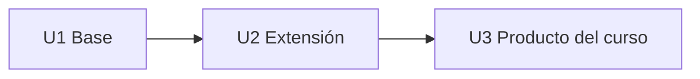

# 4. Productos por curso

| Curso | U1 (Base) | U2 (Extensión) | U3 (Producto del curso) | Tipo |
|---|---|---|---|---|
| FP (c1) | CE023a Consola (menú, condicionales) | CE023a (bucles, subprogramas) | CE023a Consola completa (archivos) | PS |
| POO (c2) | CE023b Desktop (modelo POO + CRUD consola) | CE023b Desktop (GUI + BD + capas) | CE023b Desktop completa | PS |
| IR (c3) | CE0211 SRS | CE0212 Prototipos | SRS + Prototipos integrados | PI |
| BD1 (c3) | CE0221 Modelo dominio/datos | CE0222 SQL | Modelo + SQL funcional | PI |
| LP1 (c3) | CE023c Web (Frontend/vistas) | CE023c Web (MVC + BD) | **Aplicación Web MVC integrada (PI c3)** | PI |
| ADS (c4) | CE0213 Arquitectura (C4/IEEE 42010) | CE0214 UML | Arquitectura + UML coherente | PI |
| BD2 (c4) | CE0223 Programación BD | CE0224 Seguridad/Administración BD | BD operativa segura/optimizada | PI |
| LP2 (c4) | CE023d Backend (API REST + JWT + logs) | CE023d Frontend SPA | **Aplicación Full-Stack segura (PI c4)** | PI |
| DIST (c5) | CE023e Microservicios base | CE023e Calidad (resiliencia, seguridad, consistencia) | Sistema distribuido integrado/desplegado | PS |
| MOV (c6) | CE023f App móvil (UI + local) | CE023f (API + estado + persistencia) | App móvil integrada | PS |
| IS1 (c6) | CE0243 Estrategia técnica | CE0243 Integración + calidad + deuda técnica | Sistema con decisiones de ingeniería documentadas | PS |
| PDS (c7) | CE0241 Estrategia de pruebas | CE0242 Pipeline CI/CD | Sistema validado + despliegue continuo | PS |
| IS2 (c7) | CE0244 Evaluación en operación | CE0244 Mantenimiento | Auditoría + plan de evolución | PS |

## Progresión del curso

## Tabla SW3. Evaluación progresiva y perfil de egreso

| Entregable | Artefactos progresivos (Niveles 1, 2, 3) | Artefactos del perfil de egreso (Nivel 3) |
|---|---|---|
| **Documento del sistema** (CE021 Ingeniería de Requerimientos) | CE0211 SRS IEEE 29148 (IR c3) CE0212 Prototipos navegables (IR c3) CE0213 Arquitectura IEEE 42010 / C4 (ADS c4) CE0214 Modelado UML (ADS c4) | **Especificación completa del sistema** (SRS + Arquitectura + Diseño) |
| **Base de datos del sistema** (CE022 Ingeniería de la Información) | CE0221 Modelo de dominio y de datos (BD1 c3) CE0222 SQL (BD1 c3) CE0223 Programación BD (BD2 c4) CE0224 Seguridad y Administración BD (BD2 c4) | **Base de datos operativa, segura y optimizada para entorno real** |
| **Sistema desarrollado** (CE023 Programación) | CE023a Aplicación de consola (FP c1) CE023b Aplicación Desktop (POO c2) CE023c Aplicación Web MVC (LP1 c3) CE023d Aplicación web Backend–Frontend (LP2 c4) CE023e Aplicación web Microservicios (DIST c5) CE023f Aplicación móvil (MOV c6) | **Software desarrollado (web, distribuido y/o móvil, según el problema):** - Implementación funcional - Integración de componentes - Arquitectura aplicada - Despliegue operativo |
| **Sistema validado y gestionado** (CE024 Calidad de Software) | CE0243 Backlog y Sprint ejecutados (IS1 c6) CE0241 Pruebas automatizadas (PDS c7) CE0242 Pipeline CI/CD (PDS c7) CE0244 Auditoría de calidad de software y plan de evolución (IS2 c7) | **Sistema validado, desplegado y gestionado con evidencia de calidad** |
| **Video Pitch y sustentación** | CE0217 Video Pitch y sustentación | **Defensa técnica del sistema ante jurado** |

### Notas

- Los artefactos del perfil de egreso corresponden a productos integradores evaluados en el EPE.
- No se fuerza el uso de tecnologías específicas; la solución tecnológica responde al problema planteado.
- La evaluación se realiza mediante rúbricas alineadas a cada competencia (CE021–CE024).
- La trazabilidad se establece desde las evidencias progresivas de los cursos hasta el producto final evaluado.

### Niveles de evaluación

- **Nivel 1:** FP, POO  
- **Nivel 2:** LP1, BD1, LP2, BD2  
- **Nivel 3:** DIST, MOV  
- **Nivel 3:** EPE (evaluación integral)

---