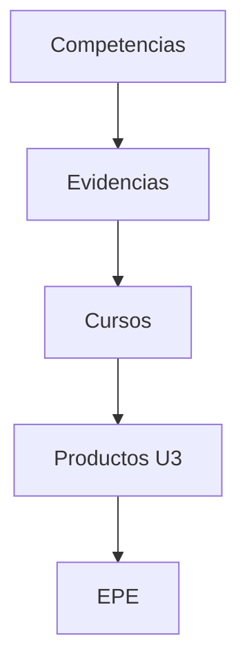

# 6. Trazabilidad completa

!!! success "Valor de esta matriz"
    Esta matriz garantiza que cada competencia:
    - se desarrolla
    - se evidencia
    - se integra
    - se valida en el EPE
    
## Trazabilidad completa — Línea Software (versión final)

| CE | Subcompetencia | Evidencias (CE02xx) | Cursos | Productos de curso (U3) |
|---|---|---|---|---|
| **CE021** | Ingeniería de Requerimientos | CE0211 SRS CE0212 Prototipos CE0213 Arquitectura CE0214 UML | IR (c3) ADS (c4) | **IR:** SRS + prototipos validados  **ADS:** Arquitectura del sistema + UML completo |
| **CE022** | Ingeniería de la Información | CE0221 Modelo de datos CE0222 SQL CE0223 Programación BD CE0224 Seguridad / Administración BD | BD1 (c3) BD2 (c4) | **BD1:** Modelo + SQL funcional  **BD2:** Base de datos operativa segura y optimizada |
| **CE023** | Programación | CE023a Aplicación consola CE023b Aplicación desktop CE023c Aplicación web MVC CE023d Aplicación full-stack CE023e Microservicios CE023f Aplicación móvil | FP (c1) POO (c2) LP1 (c3) LP2 (c4) DIST (c5) MOV (c6) | **Sistemas progresivos:** - Consola - Desktop - Web MVC - Full-stack - Microservicios - Aplicación móvil  *(El tipo de sistema depende del problema y debe justificarse)* |
| **CE024** | Calidad de Software | CE0241 Pruebas automatizadas CE0242 Pipeline CI/CD CE0243 Gestión técnica del desarrollo CE0244 Auditoría y evolución | IS1 (c6) PDS (c7) IS2 (c7) | **IS1:** Gestión técnica del desarrollo (decisiones, deuda técnica, calidad en desarrollo)  **PDS:** Sistema con pruebas automatizadas + CI/CD  **IS2:** Sistema evaluado + métricas + plan de mejora |

## Relación completa

### Principios de trazabilidad

- Cada competencia tiene evidencias progresivas
- Cada evidencia corresponde a cursos
- Las evidencias convergen en un artefacto EPE
- Cada artefacto se evalúa con rúbrica específica
- La evaluación se basa en productos reales

---

### Garantía de calidad

El modelo asegura:

- Coherencia entre formación y evaluación
- Evaluación basada en evidencia observable
- Separación clara de competencias (CE021–CE024)
- Independencia tecnológica
- Alineación con el perfil de egreso

---

### Declaración final

La trazabilidad del programa permite demostrar que cada competencia es desarrollada progresivamente y evaluada mediante productos reales, garantizando consistencia, objetividad y alineación con estándares de ingeniería de software.