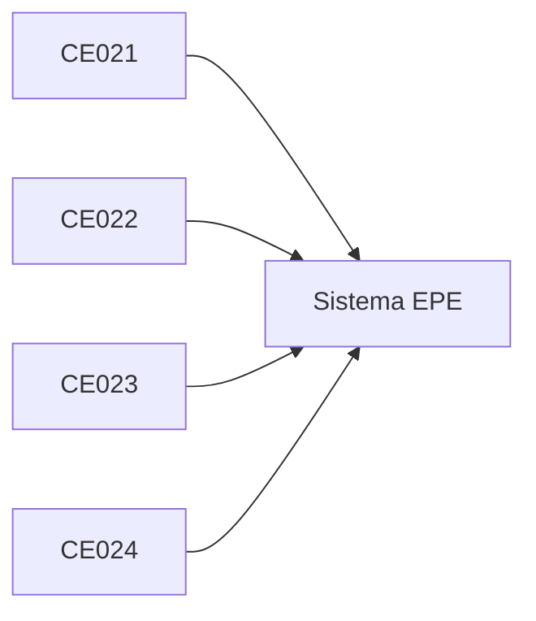

# 5. Evaluación EPE

## Matriz — Evaluación EPE (macro final)

| CE | Evidencia de perfil (integrada) | Entregable EPE | Rúbrica (criterios de evaluación) |
|---|---|---|---|
| **CE021** Ingeniería de Requerimientos | Requerimientos, prototipos, arquitectura y modelado del sistema coherentes, trazables y validados con stakeholders | **Documento del sistema:** - SRS completo - Prototipos navegables - Arquitectura (vistas, decisiones) - UML | - Completitud y claridad - Coherencia entre artefactos - Trazabilidad - Alineación con el contexto - Validación con stakeholders |
| **CE022** Ingeniería de la Información | Modelo de datos implementado, consistente y operando con seguridad y rendimiento, alineado a los requerimientos del sistema | **Base de datos del sistema:** - Modelo de datos - SQL funcional - Programación BD - Seguridad y administración | - Integridad de datos - Normalización - Rendimiento - Seguridad - Consistencia con requerimientos |
| **CE023** Programación | Sistema de software funcional, integrado y coherente con el problema planteado, implementado mediante una arquitectura adecuada | **Sistema desarrollado:** - Implementación funcional - Integración de componentes - Arquitectura aplicada - Despliegue operativo | - Funcionalidad completa - Integración entre componentes - Calidad del código - Arquitectura implementada - Desempeño del sistema - Coherencia con el problema |
| **CE024** Calidad de Software | Sistema validado, automatizado y evaluado con evidencia de calidad técnica y mejora continua | **Sistema validado y gestionado:** - Pruebas automatizadas - Pipeline CI/CD - Evidencia de calidad técnica - Auditoría + plan de evolución | - Cobertura y efectividad de pruebas - Automatización (CI/CD) - Calidad técnica - Métricas del sistema - Propuesta de mejora continua |

## Integración del perfil

