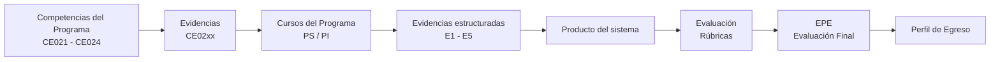

# 💻 Línea de Ingeniería de Software

Esta línea organiza la evaluación por **competencias**, **evidencias**, **cursos**, **productos** y **perfil de egreso** con el objetivo es desarrollar la capacidad de construir **sistemas de software completos, integrados y de nivel profesional**.

---

## 📂 Estructura base del modelo de la línea 

- 🏅 [Competencias](base/competencias.md)
- 📄 [Evidencias](base/evidencias.md)
- 🗂️ [Curso–Evidencia–Nivel](base/curso-evidencia-nivel.md)
- 📦 [Productos](base/productos.md)
- 📝 [Evaluación EPE](base/epe.md)
- 🔗 [Trazabilidad completa](base/trazabilidad.md)

## 🎯 También encontrarás

- 📘 [Guías de proyectos (PS / PI / EPE)](guias/proyectos.md)
- 📝 [Plantillas de entregables, desde el brief ](plantillas/brief.md)
- 📊 [Rúbricas de evaluación, desde el brief  ](rubrica/brief.md)
- 🛡️ [Estándares de Codificación](estandares/politica-codificacion.md)
- 📑 [Manuales de buenas prácticas, PR](estandares/manual-pr-github-web.md)

---

## 🔄 Flujo del modelo

---

## 📌 Alcance del proyecto de la línea

### Nombre

Sistema empresarial web con extensión móvil y/o de escritorio, desarrollado bajo enfoque de Ingeniería de Software.

---

### Descripción

El proyecto consiste en desarrollar un sistema de software que resuelva un problema real, generando valor, mejorando procesos o apoyando la gestión de la información en un contexto organizacional.

Durante el proceso, construirás el sistema de forma progresiva:

- Analizarás el contexto  
- Diseñarás la solución  
- Implementarás el sistema  
- Validarás su funcionamiento  

---

### El sistema debe:

- Funcionar correctamente  
- Integrar sus componentes (interfaz, lógica, datos y servicios)  
- Mantener coherencia entre lo requerido, diseñado e implementado  
- Ser desplegable y escalable según el contexto  

---

### Calidad del sistema

El sistema debe cumplir criterios alineados al estándar:

- ISO/IEC 25010  

---

### Evaluación

El trabajo se organiza en **evidencias de competencias estructuradas en entregables (E1–E5)**, evaluadas mediante rúbricas alineadas al programa.

---

### Evaluación final (EPE)

En la etapa final (EPE), el estudiante presenta:

- Un sistema funcional  
- Integrado  
- Validado  

Demostrando su preparación profesional.

---

## ⚠️ Importante

El problema, la solución y el alcance deben ser:

- Alineados a las competencias  
- Aprobados en la fase de Brief  

Sin esta aprobación, no se puede continuar.

---