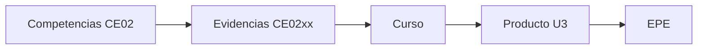

# 💻 Línea de Ingeniería de Software

Esta línea organiza la evaluación por **competencias**, **evidencias**, **cursos**, **productos** y **perfil de egreso**.

## Acceso rápido

- [1. Competencias de la línea de Software](competencias.md)
- [2. Evidencias de la línea de Software](evidencias.md)
- [3. Curso–Evidencia–Nivel](curso-evidencia-nivel.md)
- [4. Productos por curso](productos.md)
- [5. Evaluación EPE](epe.md)
- [6. Trazabilidad completa](trazabilidad.md)
- [Proyecto Sello (PS)](ps.md)
- [Proyecto Integrador (PI)](pi.md)

## Flujo del modelo

