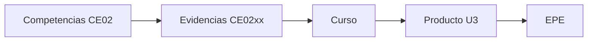

# 💻 Línea de Ingeniería de Software

Esta línea organiza la evaluación por **competencias**, **evidencias**, **cursos**, **productos** y **perfil de egreso**.

## 📂 Base

- 🏅 [Competencias](base/competencias.md)
- 📄 [Evidencias](base/evidencias.md)
- 🗂️ [Curso–Evidencia–Nivel](base/curso-evidencia-nivel.md)
- 📦 [Productos](base/productos.md)
- 📝 [Evaluación EPE](base/epe.md)
- 🔗 [Trazabilidad completa](base/trazabilidad.md)

### Rúbrica de sustentación — CE0217

- 📊 [Rúbrica de sustentación CE0217](rubrica/n3-ce0217-epe.md)

### Flujo del modelo

## 📘 Guía de Proyectos PS, PI y EPE

- [Guía de Proyectos de Software](guias/proyectos.md)

## 📚 Estándares y Manuales

- 🛡️ [Estándar de Codificación](estandares/estandar-codificacion.md)
- 🔀 [Estándar de Política de Ramas y PR](estandares/estandar-politica-pr.md)
- 📑 [Manual de PR con GitHub Web](estandares/manual-pr-github-web.md)

