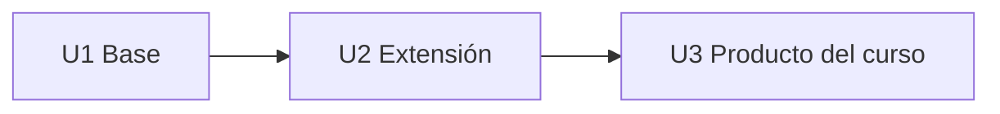

# 4. Productos por curso

| Curso | U1 (Base) | U2 (Extensión) | U3 (Producto del curso) | Tipo |
|---|---|---|---|---|
| FP (c1) | CE023a Consola (menú, condicionales) | CE023a (bucles, subprogramas) | CE023a Consola completa (archivos) | PS |
| POO (c2) | CE023b Desktop (modelo POO + CRUD consola) | CE023b Desktop (GUI + BD + capas) | CE023b Desktop completa | PS |
| IR (c3) | CE0211 SRS | CE0212 Prototipos | SRS + Prototipos integrados | PI |
| BD1 (c3) | CE0221 Modelo dominio/datos | CE0222 SQL | Modelo + SQL funcional | PI |
| LP1 (c3) | CE023c Web (Frontend/vistas) | CE023c Web (MVC + BD) | **Aplicación Web MVC integrada (PI c3)** | PI |
| ADS (c4) | CE0213 Arquitectura (C4/IEEE 42010) | CE0214 UML | Arquitectura + UML coherente | PI |
| BD2 (c4) | CE0223 Programación BD | CE0224 Seguridad/Administración BD | BD operativa segura/optimizada | PI |
| LP2 (c4) | CE023d Backend (API REST + JWT + logs) | CE023d Frontend SPA | **Aplicación Full-Stack segura (PI c4)** | PI |
| DIST (c5) | CE023e Microservicios base | CE023e Calidad (resiliencia, seguridad, consistencia) | Sistema distribuido integrado/desplegado | PS |
| MOV (c6) | CE023f App móvil (UI + local) | CE023f (API + estado + persistencia) | App móvil integrada | PS |
| IS1 (c6) | CE0243 Estrategia técnica | CE0243 Integración + calidad + deuda técnica | Sistema con decisiones de ingeniería documentadas | PS |
| PDS (c7) | CE0241 Estrategia de pruebas | CE0242 Pipeline CI/CD | Sistema validado + despliegue continuo | PS |
| IS2 (c7) | CE0244 Evaluación en operación | CE0244 Mantenimiento | Auditoría + plan de evolución | PS |

## Progresión del curso

